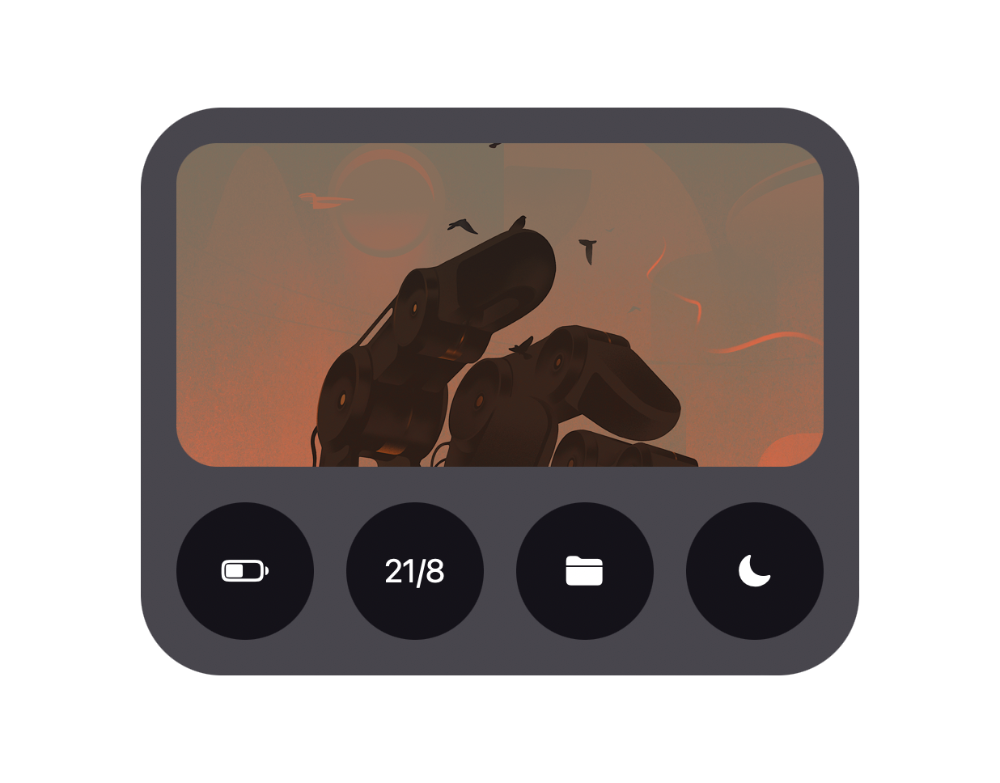
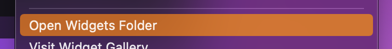

# lumin
Have you ever looked at screenshots from those linux users sharing their precious rices and been a teeny bit jealous? Well lumin will help you get some of that unix-y look.

<p align="center">
    
</p>

## So umm... what it is?
lumin is an [Übersicht](https://github.com/felixhageloh/uebersicht) widget inspired by [rofi](https://github.com/davatorium/rofi). It can mimic anything from a powermenu to an app launcher. You can customise lumin to your endless desire with styling and buttons.

## Installation
You can either git clone the repository or download the zip file and install it manually.
```bash
$ git clone https://github.com/TheCommieAxolotl/lumin.git
```

## Usage
move the downloaded folder to your Übersicht folder.



**Ta Da ✨, you now have lumin on your desktop**

## Customisation and Configuration
### Styling
lumin is extremely configurable, within `core.jsx` you will see the `config` object. this object contains all the styling that you can configure.

### Image
To customise the image, you can edit or replace the `images/main.png` file.

### Buttons
You can add/remove/edit the buttons and their icons and text by editing the initial state or direct children of the `Button` elements

```jsx
// you can either use the initialState
export const initialState =  {text: "text" }

export const render = ({text}) => {
    <Button>{text}<Button>
}

// or you can use the direct children of the Button element

export const render = () => {
    <Button>text<Button>
}
```

Buttons can do anything on [almost any React event](https://reactjs.org/docs/events.html#supported-events).


```jsx
import { run } from "uebersicht";

// run a bash command
<Button className="interactive" onClick={() => {
    run("echo 'Hello World'")
}}>click me!</Button>
```

#### For some examples and previews of lumin, have a look in the `assets` directory.